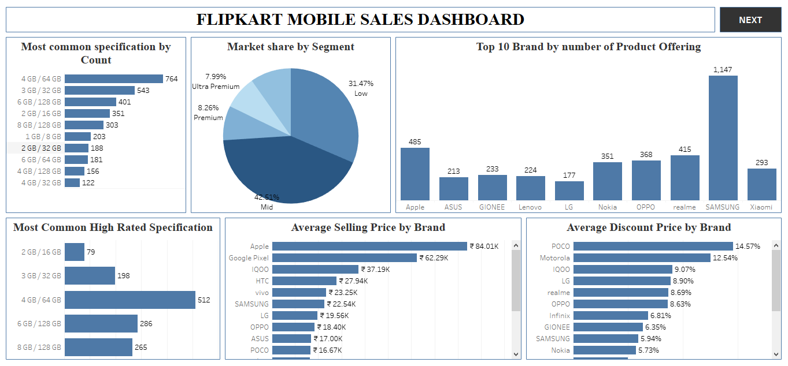
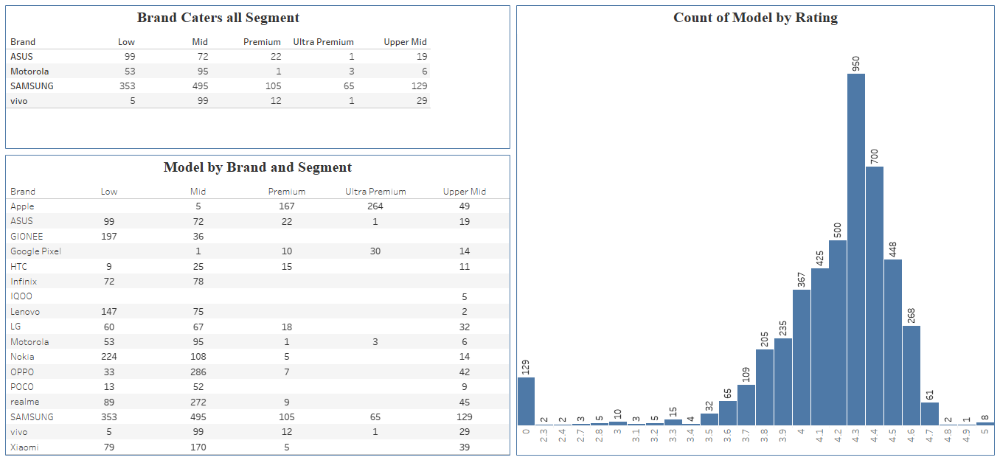

# 📊 Flipkart Mobile Sales EDA Project

This project explores and analyzes Flipkart's mobile sales dataset using Python for EDA, Excel for initial data cleaning, and Tableau for interactive dashboards.

---

## 🚀 Tools Used
- **Python (Pandas, Matplotlib, Seaborn)** – for EDA and insights
- **Microsoft Excel** – for preprocessing and data cleaning
- **Tableau** – for dashboard creation and visualization

---

## 📁 Files in this Repository
- `flipkart_sales_eda.ipynb` – Full Python EDA notebook
- `flipkart_cleaned_data.xlsx` – Cleaned dataset (Excel)
- `flipkart_dashboard.twbx` – Tableau dashboard file
- `image.png` – Dashboard preview image
- `image-1.png` – Dashboard preview image

---

## 📈 Key Insights
- Popular brands based on customer reviews & ratings
- Pricing trends across brands and RAM/storage combinations
- Impact of discounts on sales performance
- Analysis of reviews and ratings distribution

---

## 📸 Tableau Dashboard Preview

![Flipkart Dashboard] 

---

## 🧠 Skills Demonstrated
- Exploratory Data Analysis (EDA)
- Data Cleaning and Preprocessing
- Data Visualization using Tableau
- Insight Generation from e-commerce data

---